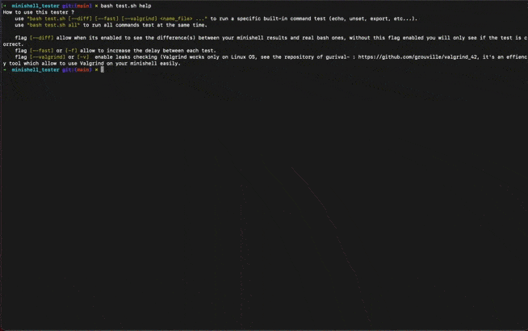
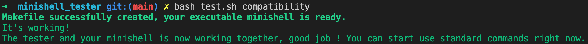

## Overview

The tester contains these features :
- ``Built-in (echo, export, cd, unset, pwd & exit)``
- ``All separators (pipes and semicolons)``
- ``Redirection (<, >, >>) and redirection of STDERROR/STDOUT/FD (2>/dev/null 2>file 1>>file 1>/dev/null)``
- ``Environment variables (there are complex tests with these)``
- ``Quotes, escaping quotes and escaping characters``
- ``Leaks with Valgrind**``
- ``Print differences between your minishell results and bash ones with exit status ($?)``
- ``Check dynamic environment variables ($_, $PWD, $OLDPWD, $SHLVL, etc...)``

** : For Valgrind check gurival's repository : https://github.com/grouville/valgrind_42, it's an useful tool to use Valgrind for MacOS.
<p align="center">Little peak of the tester :</p>
<p align="center">
  
</p>
<p align="center">And with the short flag :</p>
<p align="center">
    
</p>

## Get started (VERY IMPORTANT)
Your minishell executable must work with ``-c`` flag.

First of all, you must have the below part in your main of your minishell, otherwise you won't be able to use the tester.
If you don't understand this part or you're having some troubles, do not hesitate to contact me on Discord or Slack :
```cpp
// argv[2] will contains the content of the line for example "echo something ; ls -la" 
int main(int argc, char **argv)
{
  // Your code...
  if (argc >= 3 && !ft_strncmp(argv[1], "-c", 3))
  {
    int exit_status = ft_launch_minishell(argv[2]);
    exit(exit_status);
  }
    // Above this is the function that normally launch your minishell, instead 
    // of reading line with a get_next_line or a read() on fd 0, you just have to get
    // the argv[2] (which contains the content) and execute it.
    // Your function should return the good exit status otherwise the tests may be considered as false.
  // Your code ...
}
```
And all of your return messages from ``exit``, ``cd`` errors, ``echo`` errors should be print on ``STDERROR`` (on fd = 2).


When you have added this part in your main, your minishell's built-in ``echo`` must work for this test, let's try a :
```bash
bash test.sh compatibility
```
If you have this result then your minishell is working, you can use the tester !

## Usage

To show all explained flags and global usage of the script :
```bash
bash test.sh help 
```

Global use of the tester (To see utility of each flags check the screenshot above) :
```bash
bash test.sh [--diff] [--fast] [--short] [--valgrind] <name_file> ...
```
Some examples on how to use it :
```bash
bash test.sh --diff all
bash test.sh --diff echo 
bash test.sh --fast echo cd
bash test.sh --diff --fast echo export unset
bash test.sh --diff --valgrind all
bash test.sh -f -s -d all

```

## Contact
If you have any ideas on how to improve this tester or if you are a bug hunter, feel free to send a PM on Discord : hosrAAA#6964

https://profile.intra.42.fr/users/thallard
