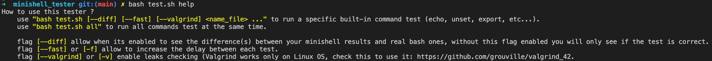

## Overview

All features of this tester are :
- ``Built-in (echo, export, cd, unset, pwd & exit)``
- ``All separators (pipes and semicolons)``
- ``Redirection (<, >, >>) and redirection of stderror (2>/dev/null)``
- ``Environment variables (there are complex tests with these)``
- ``Quotes, escaping quotes and escaping characters``
- ``Leaks with Valgrind**``
- ``Print differences between your minishell results and bash ones with exit status ($?)``

** : For Valgrind check gurival's repo : https://github.com/grouville/valgrind_42, it's a usefull tool to use Valgrind on your MacOS.


## Get started (VERY IMPORTANT)
First of all, you must have the below part in your main of your minishell, otherwise you will can't use the tester.
If you don't understand this part or have some troubles, do not hesitate to contact me on Discord or Slack : 
```cpp
// argv[3] will contains the -c flag that tester will send it, you have to check it
// argv[2] will contains the content of the line for example "echo bonjour ; ls -la" 
int main(int argc, char **argv)
{
  // Your code...
  if (argc >= 3 && !ft_strncmp(argv[1], "-c", 3)) // Check if the -c flag is enabled
    ft_launch_minishell(argv[2]);
    // Above this is the function that normally launch your minishell, instead 
    // of reading line with a get_next_line or a read() on fd 0, you just have to get
    // the argv[2] (which contains the content) and execute it.
  // Your code...
}
```

## Usage

To show all explained flags and global usage of the script :
```bash
bash test.sh help 
```

Global use of the tester (To see utility of each flags check the screenshot above) :
```bash
bash test.sh [--diff] [--fast] [--valgrind] <name_file> ...
```
Some examples of how to use it :
```bash
bash test.sh --diff all
bash test.sh --diff --fast echo export unset
```

## Contact
If you have any ideas to improve this tester or if you are a bug hunter, feel free to send a PM on Discord : hosrAAA#6964

https://profile.intra.42.fr/users/thallard
